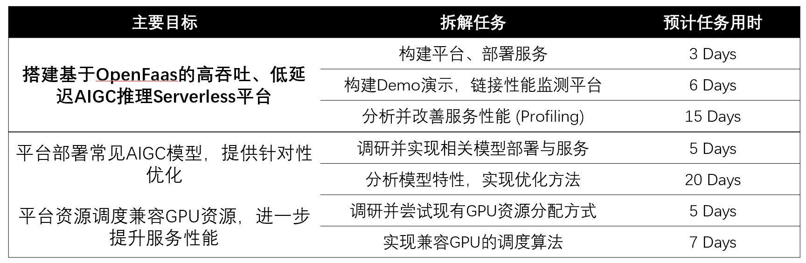
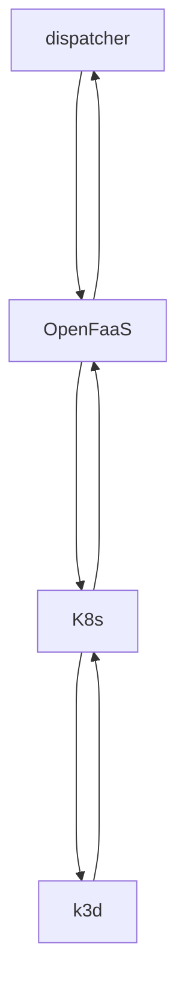
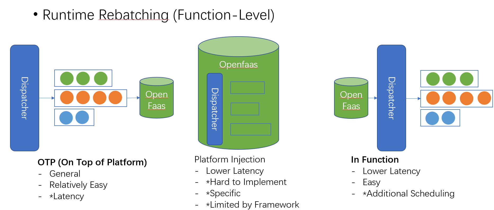

# OS Course Project

THU CSST 2023 Spring

## 1. Introduction

选题派生于2023年OS能力挑战赛赛题`proj202-Serverless-WASM-AIGC`。

### 实验目标



## 2. Design

### 2.1. Architecture



### 2.2. OTP Dispatcher



### 2.3. Repository Structure

| Path | Description |
| --- | --- |
| `batching` | Implementation of batching strategy (OTP) |
| `figs` | Figures used in this README |
| `functions` | Implementation of functions and dockerfiles |
| `gpt-2` | Implementation of GPT-2 model from another repo. |
| `stable-diffusion` | Implementation of Stable Diffusion model from another repo. |
| `test` | Test scripts |
| `Tetris` | Official code of Tetris\* from another repo. |

> \* Li, J., L. Zhao, Y. Yang, K. Zhan and K. Li (2022). Tetris: Memory-efficient Serverless Inference through Tensor Sharing. USENIX Annual Technical Conference.

## 3. Usage

### 3.1. Quick Start

> Please refer to [Wiki](https://github.com/BBQGOD/os_course_project/wiki) in this repo for pre-requisites and server setup. 

- To require text generation service, run:

    ```bash
    python test/demo_gpt2.py
    ```

- To require image generation service, run:

    ```bash
    python test/demo_sd.py
    ```

### 3.2. Replication

> Please refer to [Wiki](https://github.com/BBQGOD/os_course_project/wiki) in this repo.

## 4. Reference

> Recommended Citation: -
